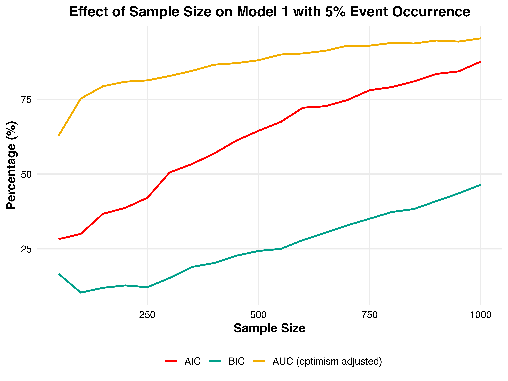
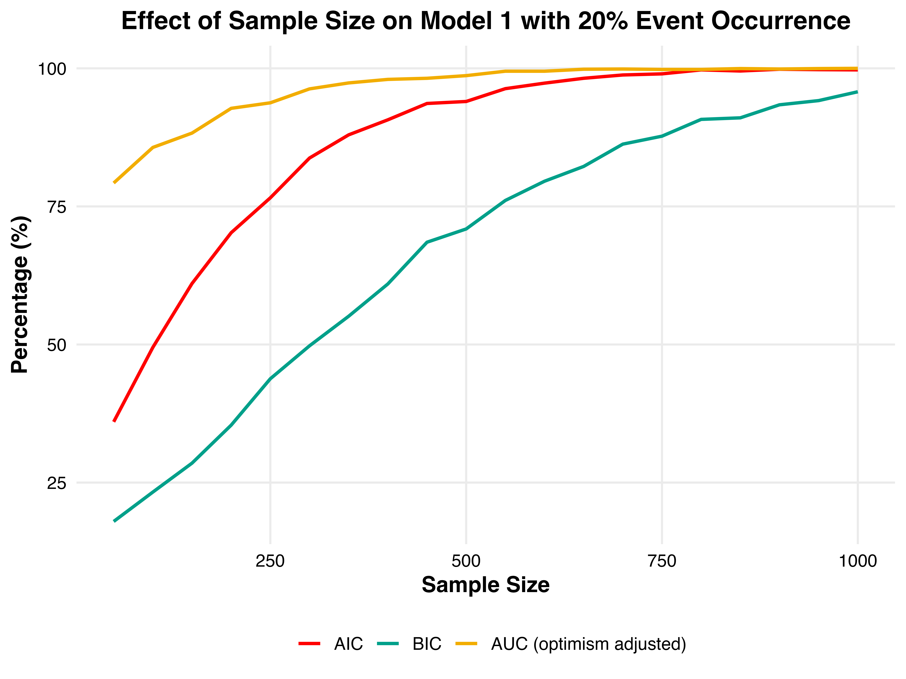
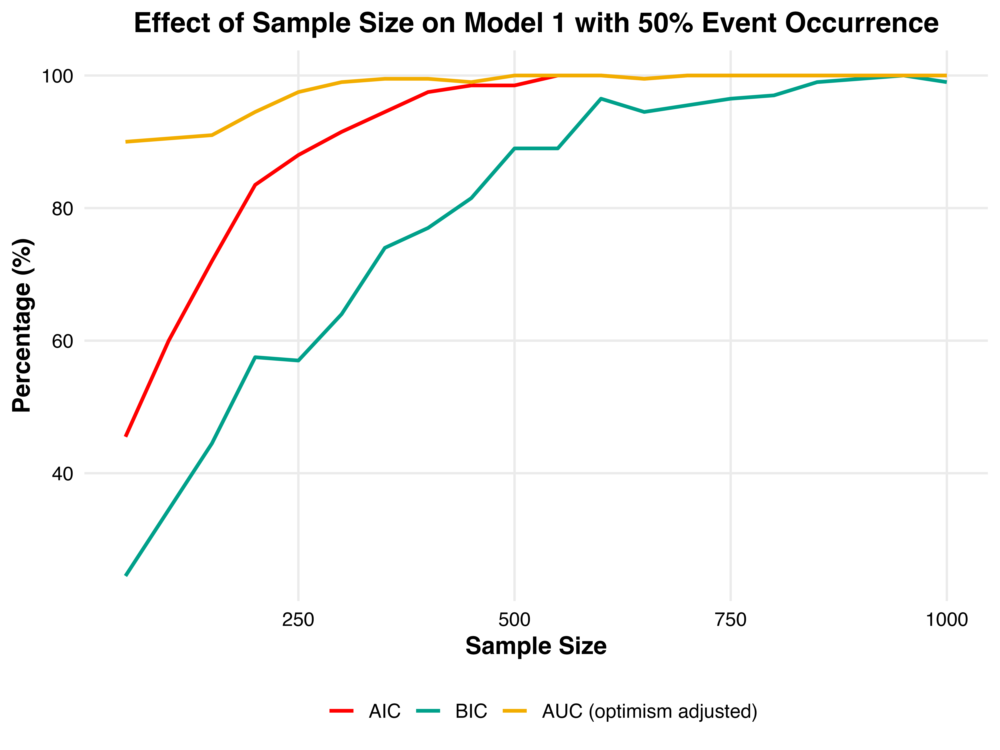

# Introduction
In public health, prediction models have the ability to target preventive interventions to persons at high risk of having or developing a disease (prognosis and diagnosis). In clinical practice, prediction models may inform patients and their doctors on the probability of a diagnosis or prognostic outcome [@moonsPrognosisPrognosticResearch2009]. Identification of patients at high risk can be based on a combination of risk factors, risk indicators or other predictors (e.g. a particular patient characteristic, bio-marker or test result). The performance of these prediction models impacts public health and clinical practice, thus making correct modelling choices crucial [@wesslerTuftsPACEClinical2017].

# Background

The traditional approach to medical prediction models uses logistic regression [@steyerbergApplicationsPredictionModels2009]. For model selection, two methodologies are often employed. Information Criteria (IC) -or model selection methods- estimate the information loss when the probability distribution of the true model is approximated by the probability distribution of a candidate model. By minimizing this discrepancy (Kullback-Leibler divergence [@kullbackInformationSufficiency1951]) between these distributions, the goal is to select the model that represents the data generating mechanism. The second methodology is the procedure of using internal model performance measures for estimating the out-of-sample performance of the proposed candidate models. Model performance includes discriminatory ability, calibration and overall accuracy. Commonly used techniques are Area under the Receiver Operated Curve (AUROC) and $R^2$, based on which the best performing proposed model can be selected.


Information criteria, like the Akaike’s information criterion (AIC [@akaikeNewLookStatistical1974]) and the Bayesian information criterion (BIC [@schwarzEstimatingDimensionModel1978]), are both commonly used for model selection in health studies. The AIC and BIC share the same goodness-of-fit term, but the penalty terms differ based on the manner in which the dimension $k$ (number of parameters) and $n$ (sample size) is incorporated: BIC employs a complexity penalization of $k\log n$ as opposed to $2k$ of the AIC. Consequently, BIC tends to choose fitted models that are more parsimonious than those favored by AIC [@neathBayesianInformationCriterion2012]. Conversely, the AIC favours more complex models in large sample setting. Information criteria only provide information about the relative quality between models using the same likelihood function and data set [@chowdhuryVariableSelectionStrategies2020].


Several internal performance measures are available for an estimate of out-of-sample model performance. The AUROC analysis is developed for predictive model selection [@pepeInterpretationROCCurve2000] and is widely adopted in clinical science to assess the model sensitivity and specificity trade-off [@collinsTransparentReportingMultivariable2015]. Bootstrapping is a preferred technique for assessing prediction models using performance measures such as AUROC [@harrellRegressionModelingStrategies2015] [@steyerbergInternalExternalValidation2003], since using the cases from the original analysis sample results in an overly optimistic performance estimate [@ledellComputationallyEfficientConfidence2015]. The AUROC is also criticized for being a semi-proper scoring rule [@zhouRelationshipIncrementalValues2021], which means that the best performance can be attained by a misspecified model. Another performance measure of prediction models is the $R^2$. In ordinary least-squares regression it is interpretable as the proportion of outcome variation, which can be explained by the predictors. Pseudo $R^2$ indices have been developed for logistic regression, such as methods of Cox and Snell [@coxAnalysisBinaryData1989], Nagelkerke [@nagelkerkeNoteGeneralDefinition1991], and McFadden [@mcfaddenConditionalLogitAnalysis1973]. Import to note is that $R^2$ measures increase monotonically with increasing number of covariates even if they have no prognostic value at all [@mittlbockNoteR2Measures2001].


Concluding, ICs and internal performance measures intend to approximate the data generating model and have the best out-of-sample performance, aiming for the highest predictive power in the total population. We are interested in their ability to choose the correct model when the data generating mechanism is known. Testing the IC success rate  and performance measures (AUROC and $R^2$) for choosing the correct model in different simulation contexts, such as sample size and data quality, may yield information for future prediction modelling choices. The according research question will be: How successful are Information Criteria and internal performance measures in choosing the correct prediction model in different simulated contexts? We expect a difference in these factors and a specific use and integration of the techniques in real life application.


# Methods {#sec3}
In this study, we focus on prediction models designed for dichotomous risk prediction, such as disease occurence. To investigate the succes rate of IC and internal performance measures, we simulated a population dataset and sampled from this dataset. The simulations were performed in R-studio [@rcoreteamLanguageEnvironmentStatistical2023b].

## Data generating mechanism
We simulated data for a setting in which there were 3 covariates (X1–X3). These covariates were simulated from independent standard normal distributions ($\mu = 0, \sigma = 1$). \
\
\begin{equation*}
\pmb{\mu} = \begin{bmatrix}
 0 \\ 0 \\ 0
\end{bmatrix}, \pmb{\Sigma} = \begin{bmatrix}
1   & 0.2 & 0.2 \\
0.2 & 1   & 0.2 \\
0.2 & 0.2 & 1   \\
\end{bmatrix}
\end{equation*}
\
All three affected the outcome. The outcome was generated from a logistic regression model with the following formula: \
\
\begin{equation}
 P(Y=1|X_1,X_2,X_3) = \frac{1}{1+e^{-(\beta_0+\beta_1X_1+\beta_2X_2+\beta_3X_3)}}
\end{equation}\
\
The coefficients were chosen to be $\beta_0 = 0, \beta_1 = 0.8, \beta_2 = 0.8, \beta_3 = 0.4$. The outcome was generated from a Bernoulli distribution with probability $P(Y=1 | X_1,X_2,X_3)$ with a cutoff value of 0.5. This results in a true C-statistic or AUROC of 0.80. A population of 2.000.000 respondents was created accordingly.

## Analysis
Success rate is analyzed by comparing the true model with the model chosen by the IC and internal performance measures. The true model was defined as the model that generated the data. The ICs and internal performance measures were calculated for all possible models. The success rate was calculated as the proportion of times the true model was chosen. The model with the lowest IC (AIC and BIC) and highest internal performance measure was chosen. AUROC is used as the internal performance measure. The AUROC was calculated using the R package pROC [@robinPROCOpensourcePackage2011]. The difference between these performances is an estimate of the optimism in the apparent performance. This difference is averaged to obtain a stable estimate of the optimism. The optimism is subtracted from the apparent performance to estimate the internally validated performance: estimated performance = apparent performance − average(bootstrap performance − test performance) [@steyerbergInternalValidationPredictive2001]. A bootstrap of 80 was performed on each iteration. A total of 2500 iterations were performed per event occurence.


# Results {#sec4}
For all sample sizes, the success rate was calculated. This is shown in plot \ref{fig:plot1}.

```{r fig.pos = 'h', echo=FALSE, fig.show='hold', out.width='30%', fig.cap="Success Rates \\label{fig:plot1}"}



```

# Discussion {#sec5}
This is a generic template designed for use by multiple journals

# Conclusions {#sec6}
This is a generic template designed for use by multiple journals


